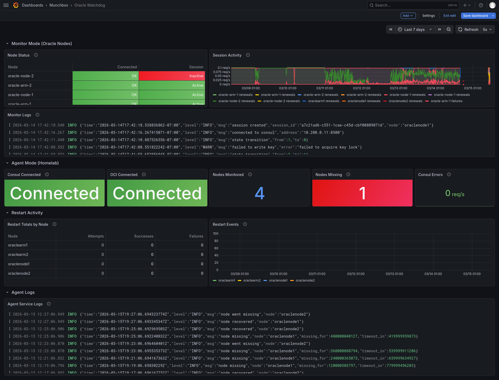

<p align="center">
  
</p>

# Oracle Watchdog

[](https://github.com/afreidah/oracle-watchdog/actions/workflows/ci.yml)
[](https://opensource.org/licenses/MIT)

<p align="center">
  <strong><a href="https://oracle-watchdog.munchbox.cc">Project Website</a></strong>
</p>



A distributed monitoring and recovery system for Oracle Cloud free-tier instances. Oracle periodically reclaims free-tier instances, leaving them in a stuck state that requires a full stop/start cycle to recover. Oracle Watchdog detects unresponsive nodes by polling Consul KV for session-locked heartbeats that expire when a node goes silent, then automatically triggers OCI restart cycles.

- **Monitor mode** runs on each Oracle node, holding a session-locked KV entry in Consul as its heartbeat signal
- **Agent mode** runs on infrastructure separate from the monitored nodes, polling Consul KV for missing heartbeats and orchestrating OCI stop/start cycles
- **Self-healing design** ensures the service never crashes due to Consul or OCI unavailability - it continuously retries and emits metrics on current state
- **OpenTelemetry tracing** provides visibility into restart cycles via Tempo

```
  Oracle Node 1           Oracle Node 2
  (monitor mode)          (monitor mode)
       |                       |
       v                       v
  +---------+            +---------+
  | Consul  |            | Consul  |
  | Session |            | Session |
  +---------+            +---------+
       \                     /
        '----> Consul <-----'
                  |
                  v
         +----------------+
         | oracle-watchdog |
         | (agent mode)   |
         +----------------+
            |         |
            v         v
          OCI     Prometheus
        (restart)  (metrics)
```

## Table of Contents

- [How It Works](#how-it-works)
- [Modes](#modes)
- [Prometheus Metrics](#prometheus-metrics)
- [Configuration](#configuration)
- [Deployment](#deployment)
- [Development](#development)
- [Project Structure](#project-structure)

## How It Works

The system operates as a distributed heartbeat monitor:

1. **Monitor** processes run on each Oracle node and create a Consul session with a 30-second TTL
2. The session is renewed every 10 seconds and locks a KV pair at `oracle-watchdog/nodes/{nodename}`
3. If a node becomes unresponsive (reclaimed by Oracle), the session expires and the KV pair is automatically deleted
4. The **Agent** process polls Consul for missing KV pairs on a configurable interval (default 30s)
5. When a node has been missing longer than the configured timeout (default 5m), the agent triggers an OCI stop/start cycle
6. The agent tracks consecutive restart attempts per node and resets the counter when a node recovers

## Modes

### Monitor Mode

Runs on each Oracle node as a systemd service. Maintains a Consul session heartbeat.

**State machine:** `disconnected` -> `connecting` -> `active`

- Creates a Consul session with 30s TTL and `delete` behavior on session loss
- Writes a KV pair locked to the session at `oracle-watchdog/nodes/{nodename}`
- Renews the session every 10 seconds
- On Consul unavailability, transitions back to `disconnected` and retries

#### WireGuard Endpoint Resolver (optional)

When the monitor config file includes an enabled `wireguard:` block, monitor
mode also re-resolves a configured peer hostname on an interval and updates
the kernel peer endpoint via netlink (`wgctrl`) when the resolved IP changes.
Useful when a WireGuard peer is reached by hostname and that hostname's IP
can change underneath the running tunnel.

- Re-resolves on a configurable interval (default 60s)
- Forces an immediate re-resolve when the most recent peer handshake is older
  than the stale threshold (default 180s)
- Picks the first IPv4 deterministically when DNS returns multiple records
- Self-healing: never crashes on DNS or netlink errors

Default-disabled and independent of the core OCI-restart flow. Add the
`wireguard:` block from `config.example.yaml` to enable.

### Agent Mode

Runs on infrastructure separate from the monitored nodes. Polls Consul KV for missing heartbeats and orchestrates OCI restarts.

**Restart sequence:**
1. Issues OCI stop command
2. Polls instance state until `STOPPED` (10s intervals, 5m timeout)
3. Issues OCI start command
4. Polls instance state until `RUNNING`

**Safety features:**
- Configurable timeout before triggering restart (default 5m)
- Configurable max restart attempts per node (0 = unlimited)
- Duplicate restart prevention via in-flight tracking
- Dry-run mode for testing (`-dry-run` flag)

#### WAN-IP DDNS Updater (optional)

When the agent config includes an enabled `wan_dns:` block, agent mode also
detects the host's public IPv4 address and keeps a Cloudflare A record in
sync. A general-purpose DDNS updater bundled into the same binary so the
agent host can publish its own changing public IP without an external client.

- Detects the public IPv4 via configurable HTTP providers (default: ipify +
  Cloudflare trace) tried in order, first success wins
- Parses both plain-text bodies and Cloudflare-trace `ip=` lines; IPv4 only
- Updates the Cloudflare A record only when the value changes
- Cooldown (default 15m, minimum 1m) enforces a minimum interval between
  successive record updates
- Cloudflare API token is read once at startup from a configurable env var
  and never enters the loaded config struct
- Self-healing: never crashes on detection or Cloudflare errors

Default-disabled and independent of the core OCI-restart flow. Add the
`wan_dns:` block from `config.example.yaml` and set `CLOUDFLARE_API_TOKEN`
(or your configured env var) to enable. The token needs `DNS:Edit` permission
on the target zone.

## Prometheus Metrics

### Monitor Mode (`:9104`)

| Metric | Type | Labels | Description |
|--------|------|--------|-------------|
| `oracle_watchdog_consul_connected` | gauge | | Consul connection status (1=connected, 0=disconnected) |
| `oracle_watchdog_session_active` | gauge | | Session status (1=active, 0=inactive) |
| `oracle_watchdog_reconnect_attempts_total` | counter | | Consul reconnection attempts |
| `oracle_watchdog_session_renewals_total` | counter | | Successful session renewals |
| `oracle_watchdog_session_failures_total` | counter | | Session creation or renewal failures |
| `oracle_watchdog_wg_endpoint_resolution_failures_total` | counter | | Resolver ticks that failed before applying an update |
| `oracle_watchdog_wg_endpoint_changes_total` | counter | | Successful peer endpoint updates applied |
| `oracle_watchdog_wg_endpoint_last_update_timestamp_seconds` | gauge | | Unix timestamp of the most recent successful update |
| `oracle_watchdog_wg_endpoint_current_ip` | gauge | `interface`, `peer`, `ip` | Always 1; current peer endpoint IP encoded in the `ip` label |
| `oracle_watchdog_wg_peer_handshake_age_seconds` | gauge | `peer` | Seconds since the most recent peer handshake; -1 if never |

### Agent Mode (`:9105`)

| Metric | Type | Labels | Description |
|--------|------|--------|-------------|
| `oracle_watchdog_agent_consul_connected` | gauge | | Consul connection status |
| `oracle_watchdog_agent_oci_connected` | gauge | | OCI connection status |
| `oracle_watchdog_agent_nodes_monitored` | gauge | | Number of configured nodes |
| `oracle_watchdog_agent_nodes_missing` | gauge | | Currently missing nodes |
| `oracle_watchdog_agent_restart_attempts_total` | counter | `node` | Restart attempts per node |
| `oracle_watchdog_agent_restart_successes_total` | counter | `node` | Successful restarts per node |
| `oracle_watchdog_agent_restart_failures_total` | counter | `node` | Failed restarts per node |
| `oracle_watchdog_agent_consul_check_failures_total` | counter | | Consul KV check failures |
| `oracle_watchdog_wan_ip_current` | gauge | `ip` | Always 1; current detected WAN IPv4 in the `ip` label |
| `oracle_watchdog_wan_ip_changes_total` | counter | | WAN IP changes detected |
| `oracle_watchdog_cloudflare_record_updates_total` | counter | `result` | Cloudflare DNS record updates split by `success` or `fail` |
| `oracle_watchdog_wan_ip_detection_failures_total` | counter | `provider` | Detection failures per provider URL |
| `oracle_watchdog_wan_dns_last_check_timestamp_seconds` | gauge | | Unix timestamp of the most recent detection attempt |
| `oracle_watchdog_wan_dns_in_cooldown` | gauge | | 1 when within the post-update cooldown window, 0 otherwise |

## Configuration

Both modes share a single YAML config file (default `/etc/oracle-watchdog/config.yaml`,
overridden with `-config`). Agent mode requires the file; monitor mode treats
it as optional and falls back to env-only operation when absent. Each mode
validates only the fields it needs.

### Agent Config

```yaml
timeout: 5m                              # How long node must be missing before restart (default: 5m)
check_interval: 30s                      # How often to scan for missing sessions (default: 30s)
consul_address: "consul.service.consul:8500"  # Consul HTTP address (default: consul.service.consul:8500)
max_restart_attempts: 0                  # Max consecutive restarts before giving up, 0 = unlimited

oci:
  config_path: "/etc/oracle-watchdog/oci-config"  # OCI SDK config file path
  profile: "DEFAULT"                              # OCI config profile name

nodes:
  - name: "oraclenode1"                           # Must match monitor's node name
    instance_id: "ocid1.instance.oc1.iad.xxx"     # OCI instance OCID
    compartment_id: "ocid1.compartment.oc1..xxx"  # OCI compartment OCID
  - name: "oraclenode2"
    instance_id: "ocid1.instance.oc1.phx.xxx"
    compartment_id: "ocid1.compartment.oc1..xxx"
```

### Monitor Environment Variables

| Variable | Default | Description |
|----------|---------|-------------|
| `CONSUL_HTTP_ADDR` | `consul.service.consul:8500` | Consul HTTP address |

### OCI Credentials

The agent requires an OCI config file with API key authentication. The config file follows the standard [OCI SDK configuration format](https://docs.oracle.com/en-us/iaas/Content/API/Concepts/sdkconfig.htm).

Required IAM permissions:
- `instance-action` (STOP, START)
- `instance-read` (GetInstance for state polling)

## Deployment

### Systemd (Monitor Mode)

Installed via Debian package on each Oracle node:

```bash
apt install ./oracle-watchdog_<version>_amd64.deb
systemctl enable --now oracle-watchdog
```

The systemd unit runs in monitor mode with the system hostname.

### Docker (Agent Mode)

```bash
make push
```

Builds and pushes multi-arch images (`linux/amd64`, `linux/arm64`) to the configured registry.

### Nomad (Agent Mode)

```bash
nomad job run path/to/oracle-watchdog.nomad.hcl
```

The jobspec should run the published Docker image with `-mode agent`, mount
the config file and OCI credentials, and expose the `:9105` metrics port.

### CLI Usage

```bash
# Monitor mode (on Oracle nodes)
oracle-watchdog -mode monitor -node oraclenode1

# Agent mode (on homelab)
oracle-watchdog -mode agent -config /etc/oracle-watchdog/config.yaml

# Agent mode with dry-run
oracle-watchdog -mode agent -config config.yaml -dry-run

# Enable OpenTelemetry tracing
oracle-watchdog -mode agent -config config.yaml -tracing
```

## Development

```bash
# --- Build ---
make build                  # local platform binary
make docker                 # Docker image for local arch
make push                   # build and push multi-arch images to registry

# --- Test & Lint ---
make test                   # unit tests with race detector and coverage
make vet                    # Go vet static analysis
make lint                   # golangci-lint
make govulncheck            # Go vulnerability scanner

# --- Release ---
make changelog              # generate CHANGELOG.md from git history (git-cliff)
make release                # tag and push to trigger GitHub Release
make release-local          # dry-run GoReleaser locally (no publish)
make deb                    # build .deb packages via GoReleaser snapshot

# --- Website ---
make web-serve              # serve project website locally with live reload
make web-build              # build static site (minified)
make web-docker             # build website Docker image for local arch
make web-push               # build and push multi-arch website image

# --- Cleanup ---
make clean                  # remove build artifacts
```

## Project Structure

```
├── .goreleaser.yaml                  # GoReleaser release configuration
├── .version                          # Semantic version tag
├── cliff.toml                        # git-cliff changelog generation config
├── Dockerfile                        # Multi-stage Alpine build
├── Makefile                          # Build, test, package, push targets
├── nfpm.yaml                         # Debian package configuration (local builds)
├── config.example.yaml               # Example agent configuration
├── cmd/
│   └── watchdog/
│       └── main.go                   # Entry point, mode routing, signal handling
├── internal/
│   ├── agent/
│   │   ├── agent.go                  # Agent mode: node monitoring, restart orchestration
│   │   └── agent_test.go
│   ├── config/
│   │   ├── config.go                 # YAML config loading and validation
│   │   └── config_test.go
│   ├── metrics/
│   │   └── metrics.go                # Prometheus metric definitions and HTTP server
│   ├── monitor/
│   │   ├── monitor.go                # Monitor mode: Consul session lifecycle
│   │   └── monitor_test.go
│   ├── oci/
│   │   └── client.go                 # OCI SDK wrapper for instance lifecycle
│   └── tracing/
│       └── tracing.go                # OpenTelemetry tracer setup and span helpers
├── grafana/
│   └── oracle-watchdog.json          # Grafana dashboard definition
├── web/
│   ├── hugo.toml                     # Hugo site configuration
│   ├── Dockerfile                    # Multi-stage Hugo + nginx build
│   ├── content/                      # Site content (Markdown)
│   ├── layouts/                      # Custom templates and shortcodes
│   ├── assets/css/                   # Custom theme variant
│   └── themes/hugo-theme-relearn/    # Documentation theme (submodule)
├── packaging/
│   ├── oracle-watchdog.service       # Systemd unit file
│   ├── config.example.yaml           # Example agent configuration
│   ├── postinst, prerm, postrm       # Debian package scripts
│   ├── copyright                     # License for Debian packaging
│   └── changelog                     # Release notes for Debian packaging
└── docs/
    ├── images/
    │   └── grafana.png               # Grafana dashboard screenshot
    └── style-guide.md                # Code style conventions
```

## License

MIT
